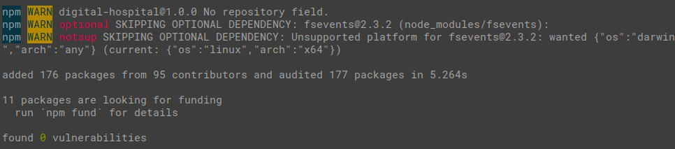
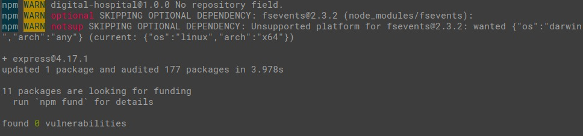
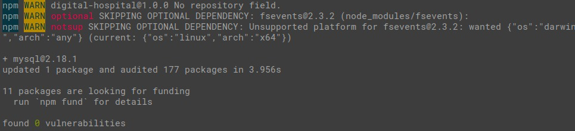
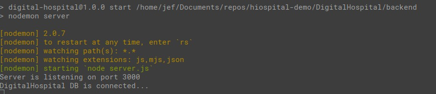
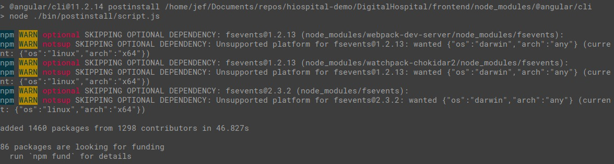
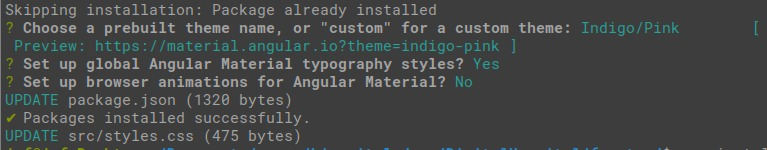
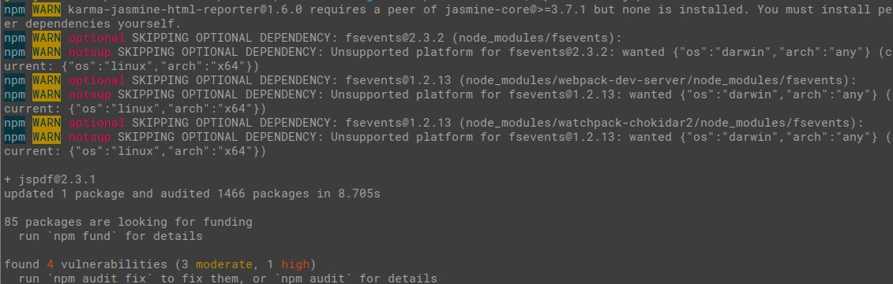

# DigitalHospital
Prueba técnica para el proceso de selección de Nativo Digital.

## Instalación

### Base de datos
1. Para instalar la base de datos necesita tener instalado [mysql](https://www.mysql.com/downloads/) y un cliente SQL ( recomendación: [DBeaver](https://dbeaver.io/download/) ).
2. Ejecutar el [script](./database/creation.sql) de creación de la base de datos. Puede encontrar más información sobre el diccionario de datos con todas las especificaciones de las entidades y atributos analizados [aquí](./database).
3. Ejecutar el [script](./database/populate.sql) de creación de registros para llenar la base de datos con información de prueba.
>Nota: En caso de ser necesario el nombre de usuario o la contraseña del usuario de la base de datos en el archivo [backend/config/db.config.js](./backend/config/db.config.js) 

### Backend
1. Para poder ejecutar correctamente el servidor necesita tener instalado [node.js](https://nodejs.org/es/).
2. Entrar a la carpeta backend y abrir la línea de comandos.
3. Ejecutar los siguientes comandos: 
``` shell
npm install
```
>Salida esparada: 

``` shell
npm install express
```
>Salida esparada: 

``` shell
npm install mysql
```
>Salida esparada: 

``` shell
npm start 
```
>Salida esparada: 

### Frontend
1. Para poder ejecutar correctamente la aplicación web necesita tener instalado [Angular](https://angular.io/guide/setup-local).
2. Entrar a la carpeta frontend y abrir la línea de comandos.
3. Ejecutar los siguientes comandos: 
``` shell
npm install
```
>Salida esparada: 

``` shell
ng add @angular/material
```
   * Para el tema del sistema seleccione la primera opción:  Indigo/Pink.
   * Para el estilo de la tipografía escriba **y**
   * Para las animaciones escriba **n**
>Salida esparada: 

``` shell
npm install jspdf --save
```
>Salida esparada: 

``` shell
npm start 
```
>Salida esparada: 

4. En el navegador, entrar a la siguiente ruta: [localhost:4200](localhost:4200)
